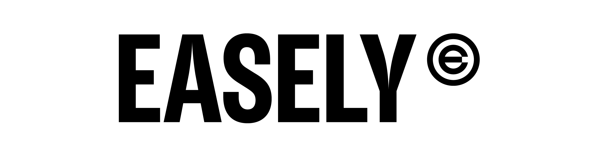
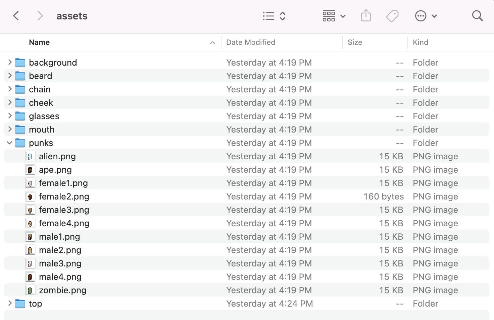
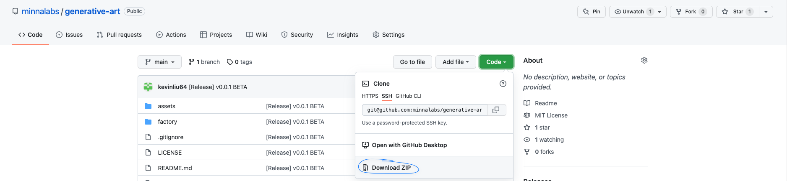
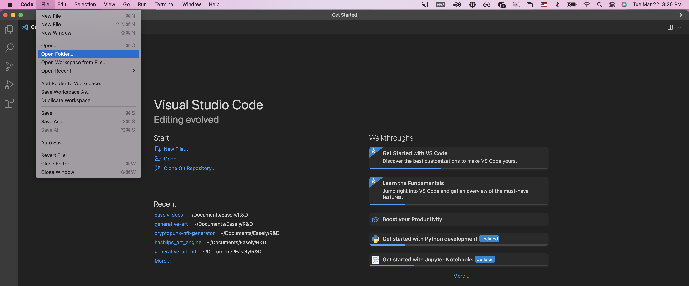
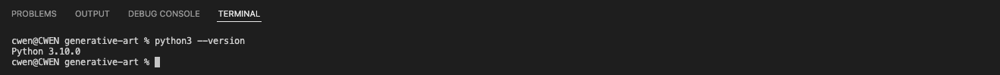
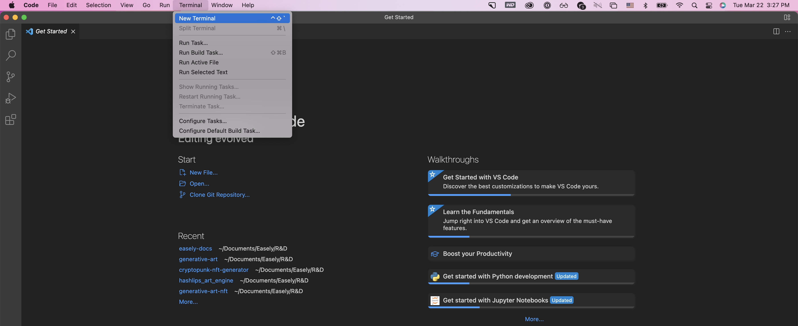
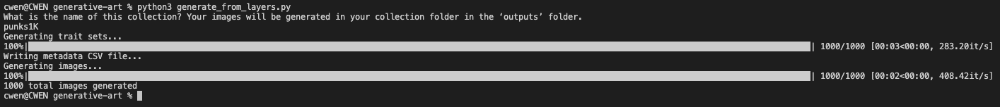
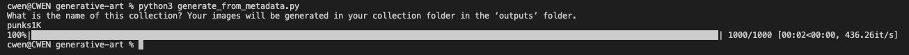

# Generative Art Tools



**NOTE: If you have any questions or would like an onboarding call, hop into our [Discord](https://discord.gg/YpA4JumgC2) and reach out to anyone on the Easely team.** 

Easely offers tools to help creators create their generative NFTs (PFP and avatar collections). Generative NFTs layer various traits (backgrounds, bodies, hats, accessories, etc.) on top of each other to randomly generate unique NFTs. This has been popularized by CryptoPunks, Bored Ape Yacht Club, Azuki, and many, many more collections. 

Although the value of PFP projects started out purely as collector value, generative NFTs have evolved into so much more: 
* Eligibility to receive additional incentives via airdrops and staking
* Membership to communities and DAOs 
* Access to real-world events as seen at NFT NYC, Art Basel Miami, and more 
* Gaming characters, items, and accessories
* Land in the metaverse

**And that is just the beginning - the beauty of NFTs is how interoperable they are, once you create your own collection and smart contract, you can integrate your NFT collection effortlessly with marketplaces, metaverses, communities, games, and more.** 

### Step 1: Creating the Layers 

Before even thinking about the blockchain, artists need to create the individual "layers" and "traits" that will be used to randomly generate the image. Typically, "layers" are the buckets of "traits" that are layered one on top of another. Not a lot of unique traits are needed to create an insanely high number of combinations - 5 layers with 6 traits each will create 15,000+ unique images. 

Some rules to keep in mind when you think about designing your layers:
* Traits are layered in sequential order (e.g. background --> body --> accessory)
* All traits should be the same exact dimensions
* All traits should have transparent backgrounds (outside of a background trait)
* Useful for later: take note of what "filters" need to be added (e.g. the Aliens in CryptoPunks don't have hair because, well, aliens don't have hair)
* Useful for later: take note of what "rarities" should be attributed to each trait and what the end rarity distribution for the entire collection should be

First, you want to determine what the layers are, how many there are, and the ordering in which they are layered. Then, you can begin creating the traits within each layer. It is important to create the traits in a manner in which they all "work" with each other (e.g. all the different "body" traits work with the various "accessory" traits). Filters can be added to guarantee or exclude certain combinations but can get complex if you add too many. 

Traits should be organized the following manner. Each "layer" should be a "folder" with its respective traits as PNG files in them. In the example below, all the "rice" PNG traits should be in a "rice" layer folder. (Note: how you name these folders is how the layer category will show up in the metadata so use proper formatting and capitalization as much as you can)



### Step 2: Prepping the Work Environment

In order to use Easely's tools, it is required to download some basic dev apps. **Don't worry - there will be no coding required - the actual "dev" work should be as trivial as copy and pasting code and filling out basic config details.** 

#### Download VS Code

VS Code is a dev environment that you will need to use Easely's generative art program. You can download and install it [here](https://code.visualstudio.com/download)

#### Download and Open Easely's Code Repo

Next, download Easely's [code repo](https://github.com/minnalabs/generative-art) that includes a set of programs for you to generate, revise, and finalize your art pieces. Unzip the file and move the folder (titled `easely-generative-art`) to your preferred working location on your computer. 



Now, open VS Code that you installed earlier and go to 

```
file --> open folder --> select the `easely-generative-art` folder --> open
```



VS Code will now open Easely's generative art programs. There should be an `assets` folder - **you can test with these example layers or replace this folder with your layers and traits.** 

#### Download Python3, pip, and required packages

**NOTE: The below instructions are for Mac computers, please see the Windows tutorial in the appendix below** 

The last step is to download the correct software languages and packages used in the generative art program. For the more technically inclined, you can find the list of programs in the `requirements.txt` file. 

Python is a coding language and is built into most operating systems today, but the latest version is recommended to reduce issues. Python3 can be downloaded and installed [here](https://www.python.org/downloads/). Type and enter in Terminal (Mac) to check your version is up to date and that python3 is working properly.

```jsx
python3 --version
```



pip is the Python installer program used to install the remaining packages in our tool. **Open up a new Terminal / Command Line in VS Code** (menu --> Terminal --> New Terminal). A console should pop up underneath the code that you can type in. 



Type and enter the following to install all the required packages

```jsx
pip3 install -r requirements.txt
```

You should receive a successful installation message and now your work environment is now successfully prepped! Here's a summary of the programs below and how they will be used throughout the rest of this guide:

#### Programs
1. `generate_from_layers.py`: Program that generates the images (NFTs) from your layers and traits depending on your `config.yaml` parameters
2. `generate_from_metadata.py`: Program that generates the images (NFTs) from your layers and traits specified in a `metadata.csv` spreadsheet
3. `upload.py`: Program that uploads your final images (NFTs) to IPFS, a decentralized file hosting protocol and the gold standard of storing NFTs. Your NFT collection on the blockchain will then link to this IPFS directory that will exist in perpetuity. **Your images need to be uploaded into a single IPFS directory to continue with Easely's platform**

#### Other
1. `config.yaml`: File that defines all the parameters for your art generation: # of images, layer ordering, trait rarity probabilities, rules, and more
2. `assets` folder: Folder where you will add your layers and traits to 
3. `output` folder: Folder where your generated collections and images (NFTs) will be 
4. `requirements.txt`: Text file that has the list of python packages necessary for the generative art tools
5. `README.md`: Instructions on how to operate the various programs (similar to this doc)

### Step 3: Configuring and Generating the Collection

#### Configuration Parameters

**NOTE: if you already have the metadata for each image you plan to generate in a spreadsheet, feel free to jump to the 2nd part of the Generation section**

Otherwise, you will configure your generation parameters in a `config.yaml` files. We will be using the following below as an example to explain each parameter:

```jsx
count: 1000
filetype: "png"
assets:
  path: "assets"
  layers:
    - name: "background"
      required: True
    - name: "punks"
      required: True
      rarity_weights:
        alien: .1 // decimals work too! .1 = .1% 
        ape: .9
        female1: 12
        female2: 12
        female3: 12
        female4: 12
        male1: 12
        male2: 12
        male3: 12
        male4: 12
        zombie: 3
    - name: "top"
      required: True
    - name: "beard"
      required: True
    - name: "glasses"
      required: False
    - name: "mouth"
      required: False
    - name: "cheek"
      required: False
    - name: "chain"
      required: False
      rarity_weights:
        None: 80
        gold_chain: 10
        silver_chain: 10
```
1. `count`: The number of unique images you wish to generate after duplicates have been removed and rules have been applied
2. `filetype`: Specify whether images files are JPGs or PNGs
3. `layers`: The schema for each `layer` of your NFT, e.g. 'background' or 'body' or 'accessory'. Layers have 3 components to them: `name`, `required`, and `rarity_weights` 
    * `name`: This is the layer name **and folder name** that your traits are in. This will also be the official metadata name for the layer: what gets stored on the blockchain and what gets populated in secondary marketplaces or rarity tools that read the blockchain. **It is important that you have the exact syntax (capitalization, symbols, etc.) when generating the NFTs**
    * `required`: Whether or not a trait within this layer is required, denoted by a `True` or `False`. If `False`, there is a chance that no trait within the layer will be selected  
    * `rarity_weights`: The ability to specify different probabilities for each trait within a layer. A couple rules regarding rarity weights:
        * If `rarity_weights` is not specified, there is an equal chance that all traits get selected (including the odds of no trait if `required: False`)
        * If you choose to specify `rarity_weights`, each number next to a trait is the % probability the trait gets selected
        * All traits must have a % probability associated with them 
        * All % probabilities must sum to 100 
        * If `required: False`, you must add a % probability to `None` aka the probability for no trait 
        * The output will not perfectly reflect your `rarity_weights` depending on how many images you're generating, how many duplicates need to be removed, how strict your configurations are, what rules you apply, and many other factors. `rarity_weights` are meant to help you progress in a manner that is directionally correct - this process is certainly never completed in just 1 generation
        * Trait names must match file names exactly - do not worry including the file extension (e.g. .png)

Once all parameters are set, let's move on to actual image generation!

#### Advanced Configuration Parameters: Rules

As mentioned earlier, often times there are certain rules you want your trait generation to adhere to. Easely's generative art program has the ability to set `notequals` and `equals` rules on your traits. This can be found in the example config under `rules:` right below the trait config: 

```jsx
rules:
  - filter: "notequals"
    trait_1:
      name: "punks"
      value: "alien"
    trait_2:
      name: "top"
      value: "wild_blonde"
  - filter: "notequals"
    trait_1:
      name: "punks"
      value: "alien"
    trait_2:
      name: "top"
      value: "wild_hair"
  - filter: "equals"
    trait_1:
      name: "background"
      value: "purple"    
    trait_2:
      name: "punks"
      value: "female1"
```

In this example, the `alien` trait will never be matched with `wild_blone` or `wild_hair` hat traits (because aliens don't have hair!). `puprple` backgrounds will also always result in the `female1` trait. **If you do not want to include any rules, feel free to delete this portion of the `config.yaml` file and no rules will be applied** 


#### Generation 

Most creators will fall in two categories here: 1) creators that only have their assets (layers and traits) and 2) creators that have their assets AND the metadata ready for each image

**1. Creators with Assets:** Your image generation will depend on the `config.yaml` file as denoted above. Once you have the config file setup to your liking, pop open the terminal again and type and enter the following: 

```jsx
python3 generate_from_layers.py
``` 

You will be prompted to name your collection - answer accordingly in the terminal and hit enter. Once the program finishes (and the progress bar is complete) you can navigate into your `outputs` folder and see the collection you just created with an `images` and `metadata` folder. The `metadata` folder will have a .csv file (spreadsheet) of all the randomly generated traits based on the `config.yaml` parameters, with duplicates removed and rules applied. The `images` folder will have the respective images with filenames that tie to the `metadata.csv` file.



**2. Creators with Assets + Metadata:** Create a new folder in `outputs` with your collection name. In that folder, create another folder called `metadata`. In the `metadata` folder you just created, drop in your `metadata.csv` file that should be structured in the following format: 

| filename  | layer 1    | layer 2    | layer 3    | layer N...    |
| --------- | ---------- | ---------- | ---------- | ----------    |
| file 1    | trait 1    | trait 1    | trait 3    |               |
| file 2    |            | trait 1    | trait 1    |               |
| file N... | trait 2    |            | trait 2    | trait 6       |

Please note that the `layer` names should match the folder names in your `assets` folder and be laid out in sequential order as each increasing layer is layered on top of the previous one. The `trait` names should also match the trait files in each layer folder as well (no extension, e.g. .png, is necessary in `metadata.csv`). **All layer and trait names must match the resulting files and folders with the exact syntax (capitalization, spacing, etc.) for the program to execute.** `filename` you can either fill out or leave blank - it will be rewritten after the image generation is completed such that each row of metadata matches the correct image name. Now run the program:

Then you want to edit your `config.yaml` file so the program knows the ordering of the layers to generate from your metadata. Since we are just generating from a spreadsheet of metadata, none of the other parameters (e.g. count, rarity_weights, required, etc.) will be relevant here. List the layers and their folder names in the order you want them to be generated. 

```jsx
filetype: "png"
assets:
  path: "assets"
  layers:
    - name: "background"
    - name: "punks"
    - name: "top"
    - name: "beard"
    - name: "glasses"
    - name: "mouth"
    - name: "cheek"
    - name: "chain"
```

Now execute the following program in the terminal to generate images from pre-determined metadata!

```jsx
python3 generate_from_metadata.py
``` 

and you will be prompted to enter the collection (folder) name. Answer accordingly with the folder you just created. The program will run and generate images based off the `metadata.csv` file.



### Step 4: Curating and Finalizing the Collection

No generation is perfect on the first try (unless you are creating on-chain generative art - which Easely will support soon!) and will require varying parameters and curating the final pieces **so the end collection really feels like magic**. Many creators recommend creating 20%+ more than the intended final collection size (e.g. 12,000 if the collection is 10,000) because you realize that a lot of combinations don't make sense or aren't up to par right off the bat. 

The primary method of parsing the collection down and curating the final collection is by deleting rows in the `metadata.csv` file and running `generate_from_metadata.py` over and over again. You can manipulate the `metadata.csv` file by opening with a variety of spreadsheet programs - Excel, Numbers, Google Sheets, etc. You can then easily filter for different combinations of traits that you want to delete or delete rows manually. You can also add in new rows with traits here. **Just be sure that you never have two rows that have the same metadata and that any traits / layers specified tie exactly to the file names in the `assets` folder.** 

We highly encourage you to play around with the possible configurations and have a strong understanding of every parameter. There is no harm in generating small sample sizes to better understand rarity weights, layer ordering, and most importantly, what the layers look like on top of each other. **This is an incredibly iterative process and many edits to configs and layers and traits will be made throughout so do not feel like 1 generation is all that's required**. And once you have a basic understanding of the program, you unlock a lot more complex capabilities. 

For example, some creators have a single collection that have multiple unique base assets. Take [SecondSelf](https://www.secondselfnft.com) - their collection had 6 base characters that each had their own unique assets that fit their respective character model (meaning 6 different `assets` folders). They were able to pull this off by running this program for each character and keeping track of 6 `metadata.csv` files and 6 different `image` outputs. Then they meticulously combined the images in a folder and the metadata all together before uploading this to Easely's no-code platform. If you decide to manually alter metadata after the image generation, be sure to **double, triple, and even 10x check that all the metadata match the images correctly, tied by image name. You will not be able to change the metadata once these images are minted as NFTs**

### Step 5: Uploading to IPFS and Turning the Collection into NFTs

The final step is to upload your collection to [IPFS](htpps://ipfs.io), the decentralizing file storing protocol and the industry standard for storing NFTs today. An easy way to store your files can be done via [Pinata](https://pinata.cloud) and it is recommended that you pin the NFTs yourself (so no one but you can ever possibly unpin them!). **If you have trouble pinning or prefer not to pin the images to your final generative art collection, feel free to contact the Easely team in our Discord, and we will help you out!** Otherwise, see below instructions on pinning and uploading your images to IPFS. 

#### Create a Pinata Account

Create a [Pinata](https://pinata.cloud) account and choose the plan appropriate for your collection (pinata offers free hosting up to 1GB of data). 

#### Create and Store your API Keys

Login to your Pinata account, click on your profile in the upper right corner, and select `API Keys`. Create a new API key and store the `JWT` in your secure password manager. 

#### Config and Run upload.py

Now pop open `upload.py` and paste in your `JWT` in rows 6, 7, and 8. Now run `upload.py` using the following in terminal: 

```jsx
python3 upload.py
```

You will be prompted to name the collection that you would like to submit and the program will begin uploading to IPFS. **Please note that pinning files to IPFS takes a bit of computing power and cannot be interrupted in between. As a benchmark, a computer with 16GB RAM can handle ~10GB upload. If you have issues with collection sizes being too large, contact the Easely team on Discord**. 

### Step 6: Save the IPFS CID and Create your Collection on Easely

Once the images have been saved to IPFS successfully, a new folder in `final` will be created with a single file that contains the IPFS CID (Content Identifier) for your NFTs! Now go ahead and head over to [Easely MainNet](https://app.easely.io) or [Easely TestNet](https://app.rinkeby.easely.io) and create a `Randomized Collection`. You now have the **final images to your generative NFT collection hosted on IPFS, accessible via the IPFS CID** that you will drop in once prompted in the NFT creation process!